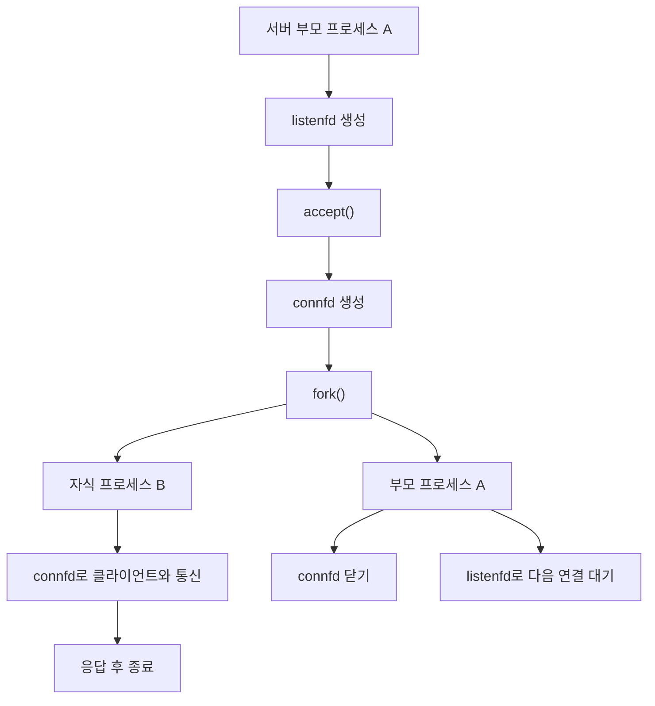

# CSAPP Ch11 웹서버 입문 - QnA 학습 로그

> 원칙
> - 전체 요약이 아니라, 사용자가 되묻는 질문 단위로 습득 지식을 누적 정리한다.
> - 각 항목은 핵심 개념, 오해 포인트, 확인 질문(셀프체크) 중심으로 기록한다.

---

## 2026-04-17 Q1. Echo 서버와 Tiny의 역할 이해

### 질문
- "에코 서버가 바이트를 보내면 웹이 의미로 해석하고, 이후 Tiny가 정적 파일/CGI로 서버코드를 묶는다"는 이해가 맞는지?
- Tiny가 정확히 무엇을 하는지?

### 핵심 개념
- Echo 서버는 **학습용 최소 서버**다. 받은 바이트를 그대로 다시 돌려주며, HTTP 의미 해석은 거의 하지 않는다.
- 웹 브라우저는 응답 바이트를 **HTTP 형식(상태줄/헤더/본문)**으로 해석한다.
- Tiny는 Echo보다 한 단계 높은 **진짜 웹서버 입문 모델**이다.
- Tiny의 핵심 역할:
  - 요청 읽기
  - URI 분석(정적/동적 구분)
  - 정적 파일이면 파일을 읽어 응답
  - 동적 요청이면 CGI 프로그램 실행 후 결과를 응답

### 비유로 이해
- Echo 서버: "말 따라하기 로봇"
  - 네가 말한 문장을 뜻도 모르고 그대로 따라 말함.
- Tiny 서버: "작은 식당 점원"
  - 주문서(HTTP 요청)를 읽고,
  - 메뉴판에 있는 일반 메뉴(정적 파일)면 바로 가져다주고,
  - 주방 계산이 필요한 메뉴(CGI)면 주방에 요청해서 결과를 받아 서빙함.

### 오해 포인트 교정
- "Echo가 웹에 의미를 보낸다"는 표현은 부정확하다.
  - 정확히는: Echo는 바이트를 반환할 뿐이고, 브라우저/클라이언트가 프로토콜 문맥으로 해석한다.
- "Tiny가 서버코드를 묶는다"보다 정확한 표현:
  - Tiny는 HTTP 요청을 처리해 정적/동적 리소스를 선택하고 응답을 구성하는 서버 프로그램이다.

### 확인 질문(셀프체크)
- Echo 서버와 Tiny 서버의 가장 큰 기능 차이를 한 문장으로 말할 수 있는가?
- Tiny에서 정적 컨텐츠와 CGI 요청이 분기되는 기준(URI/경로)을 설명할 수 있는가?

## 2026-04-17 Q2. 정적/동적 분리의 본질 정리

- 정적은 이미 만들어진 파일을 읽어 응답하고, 동적은 CGI 같은 서버 프로그램을 실행해 결과를 만들어 응답한다.
- 정적은 반복 요청이 많아도 매우 빨리 처리할 수 있다.
- 동적은 실행 비용이 크고, 잘못된 코드면 서버가 느려질 수 있다.
- 두 종류를 분리하면 '빠른 파일 전달 경로'와 '연산 경로'를 분리해 관리할 수 있다.
- 비유로: 정적은 기존 메뉴판 PDF를 즉시 복사해 주는 것, 동적은 주문을 받아 조리하는 주방 동작이다.

## 2026-04-17 Q3. 클라이언트/서버와 호스트 관계 정리 (비유 기반)

- 호스트는 건물, 클라이언트/서버는 그 건물 안에서 역할을 하는 사람(프로세스)으로 생각하면 된다.
- 클라이언트는 요청을 보내는 역할(손님), 서버는 응답을 보내는 역할(점원)이다.
- 같은 호스트에 있을 수도 있고, 다른 호스트에 있을 수도 있다.

- 동일 호스트 트랜잭션
  - 예: 내 PC에서 브라우저(클라이언트)와 로컬 웹서버(서버)가 `localhost`로 통신.
  - 건물 하나에 손님+점원이 같이 있는 상황.

- 다른 호스트 트랜잭션
  - 예: 내 PC의 브라우저와 인터넷의 원격 웹서버가 통신.
  - 손님과 점원이 다른 건물에 있는 상황.

- 핵심 정리
  - 클라이언트/서버는 역할, 호스트는 위치.
  - 트랜잭션은 역할 간 대화고, 대화 상대는 같은 건물/다른 건물에 모두 있을 수 있다.
  - 그래서 실제 통신에서는 `IP 주소+포트`로 상대 호스트와 프로세스를 찾아 연결한다.

## 2026-04-17 Q4. 트랜잭션의 정확한 뜻

- 트랜잭션은 클라이언트와 서버가 주고받는 `하나의 작업 단위`다.
- 보통 `요청(Request)` + `응답(Response)`의 한 쌍으로 본다.

- 비유
  - 건물(호스트) 안/밖의 손님과 점원이 대화할 때, "메뉴를 주문하고 계산서를 받는 한 번의 교환"이 바로 트랜잭션.
  - 손님이 여러 번 대화하면 트랜잭션도 여러 번 발생.

- 네트워크 관점
  - 하나의 HTTP 트랜잭션은 보통 다음 단계로 구성됨.
    - 클라이언트가 HTTP 요청 라인/헤더/본문을 보냄
    - 서버가 요청을 해석해서 상태코드+헤더(+본문)로 응답
  - 이 한 세트를 합쳐 트랜잭션이라고 부른다.

- 핵심 정리
  - 트랜잭션은 "연결 자체"가 아니라, "의미 있는 요청-응답 일의 완결 단위"다.
  - 같은 연결 안에서 여러 트랜잭션이 순차로 이어질 수 있다.

## 2026-04-17 Q5. Echo 서버의 의미와 필요성

- Echo 서버는 요청(바이트열)을 기본적으로 그대로 받아 다시 보내는 서버다.
- 하지만 `"아무 기능도 없는 서버"`가 아니다.
- 역할:
  - 네트워크 통신의 핵심 구조(소켓 연결, read/write, close)만 훈련
  - 서버 내부 로직과 분리해 통신 파이프라인을 검증
  - 버그 진단이 쉬운 최소 동작 모델 제공
  - Tiny/Proxy의 기본 흐름 전에 연습할 수 있는 입문용 기준점
- 비유:
  - Echo = 통신 회선 테스트용 에코기(돌려주기만 함)
  - Tiny = 그 위에 HTTP 해석/정적·동적 처리/응답 생성까지 붙인 본기능 서버

## 2026-04-17 Q6. 소켓과 통신 흐름 정리

- 소켓은 통신 주체가 아니라 통신 연결을 위한 수단(통로/도구)이다.
- 정밀한 표현: `클라-소켓-프록시-타이니` 보다는 `클라(브라우저) ↔ 프록시 ↔ 타이니`가 개념상 맞다.
- 클라이언트-프록시 구간 소켓 1개, 프록시-타이니 구간 소켓 1개가 각각 열려 있다.
- 정리: 각 호스트/프로세스 쌍 사이마다 별도의 TCP 소켓 연결이 성립한다.

## 2026-04-17 Q7. 왜 프록시를 두는가 (DNS 외의 이유)
- DNS 변환이 안 돼서 프록시가 필요한 건 아니다.
- 브라우저는 일반적으로 직접 hostname을 IP로 바꿔 origin 서버와 연결할 수 있다.
- 그럼에도 프록시를 두는 핵심은 중간 계층 분리에 따른 이점 때문이다.

### 프록시(중간 계층 분리)의 핵심 가치
- 보안/정책: 인증, 접근 제어, 요청 차단(필터링), 감사 로그를 중앙에서 관리
- 캐시: 자주 가는 정적/응답 데이터를 저장해 성능 개선
- 로깅/모니터링: 모든 요청을 한 지점에서 추적
- 트래픽 제어: 회선 제한, 레이트리밋, 요청량 제한
- 장애/격리: 내부망에서 내부 서버를 숨기고 origin 직접 노출 감소
- 연결 효율: 클라이언트와 프록시, 프록시와 origin 각각의 소켓 관리로 연결 패턴 제어
- 네트워크 경로 제약 대응: 클라이언트 직접 접근이 어려운 환경에서 게이트웨이 역할

- 정리: 프록시는 단순 주소 변환기가 아니라 **중계 + 가공 + 정책/캐시(구현에 따라)**를 수행하는 계층이다.

## 2026-04-20 Q8. 서버 프로세스와 `fork()`의 관계

### 질문
- 서버 프로세스 A가 `listenfd`, `connfd`를 가진 상태에서, 클라이언트와 통신하기 위해 서버가 자기 자신을 `fork()`해서 자식 서버 프로세스 B를 만들고 그 B가 클라이언트-서버 연결을 담당한다는 이해가 맞는가?

### 핵심 개념
- 이해의 방향은 **절반만 맞고, 표현은 조금 수정해야 한다**.
- 서버가 `fork()`를 하는 이유는 보통 **클라이언트와의 연결을 자식 프로세스가 맡게 하려는 것**이다.
- 하지만 "클라이언트와 연결하기 위해 서버가 먼저 자기 자신을 복제한다"가 핵심은 아니다.
- 정확한 흐름은 보통 다음과 같다.
  - 서버 부모 프로세스 A가 `listenfd`로 연결 요청을 기다린다.
  - 부모 A가 `accept()`로 `connfd`를 얻는다.
  - 그 다음 `fork()`를 해서 자식 B를 만든다.
  - 자식 B가 `connfd`로 클라이언트와 실제 통신한다.
  - 부모 A는 `connfd`를 닫고 다시 `listenfd`로 다음 연결을 기다린다.

### 왜 이렇게 하는가
- 여러 클라이언트를 동시에 처리하기 위해서다.
- 부모는 새 연결을 계속 받는 역할에 집중하고, 자식은 이미 연결된 한 클라이언트 처리에 집중한다.
- 이렇게 하면 각 클라이언트 요청을 독립적으로 다루기 쉬워진다.

### 흐름 그림

### 오해 포인트 교정
- `listenfd`는 부모가 계속 들고 있는 대기용 소켓이다.
- `connfd`는 `accept()`로 만들어진 실제 통신용 소켓이다.
- 자식 프로세스 B는 보통 `connfd`를 사용해서 클라이언트와 통신하고, `listenfd`는 부모가 계속 유지한다.
- 따라서 `fork()`는 "연결 생성" 자체가 아니라, **연결 처리 역할 분리**를 위한 도구다.

### 셀프체크
- `listenfd`와 `connfd`의 역할을 구분할 수 있는가?
- `accept()`가 먼저인지 `fork()`가 먼저인지 설명할 수 있는가?
- 부모 프로세스와 자식 프로세스가 각각 어떤 fd를 닫아야 하는지 말할 수 있는가?
