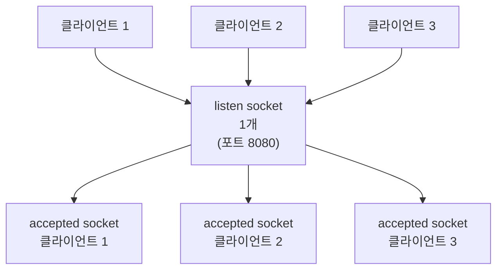
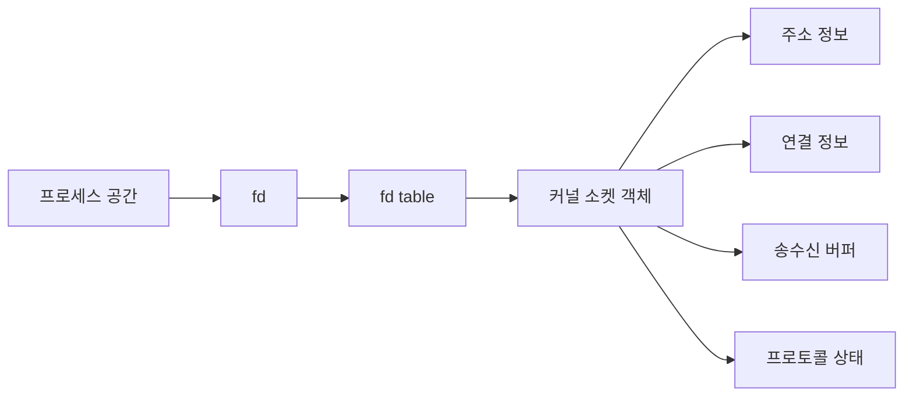
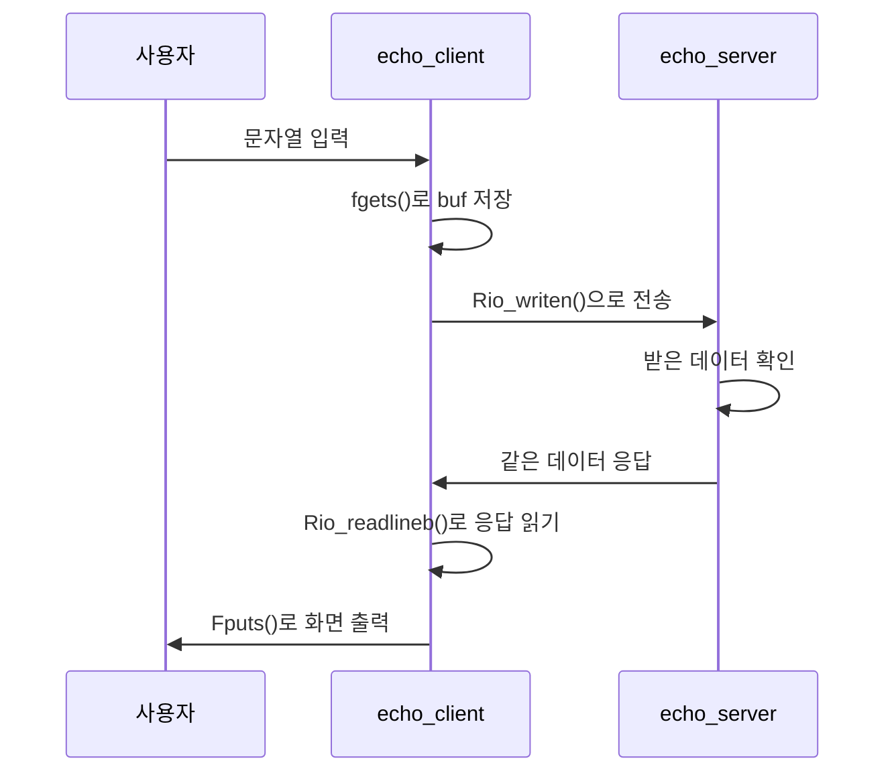
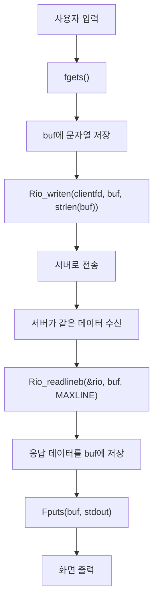
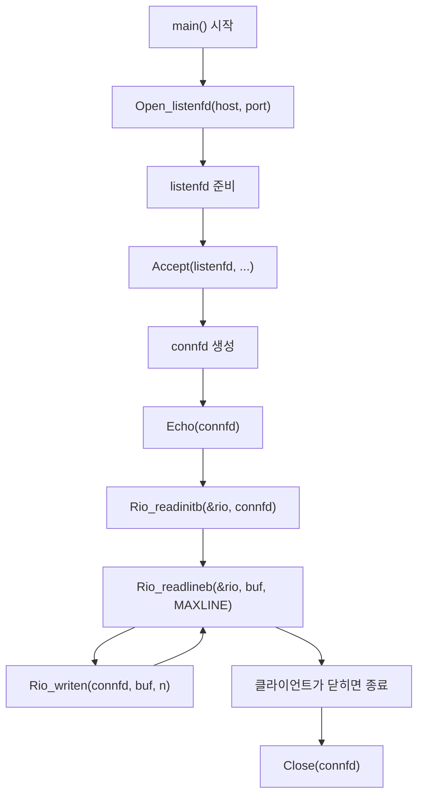
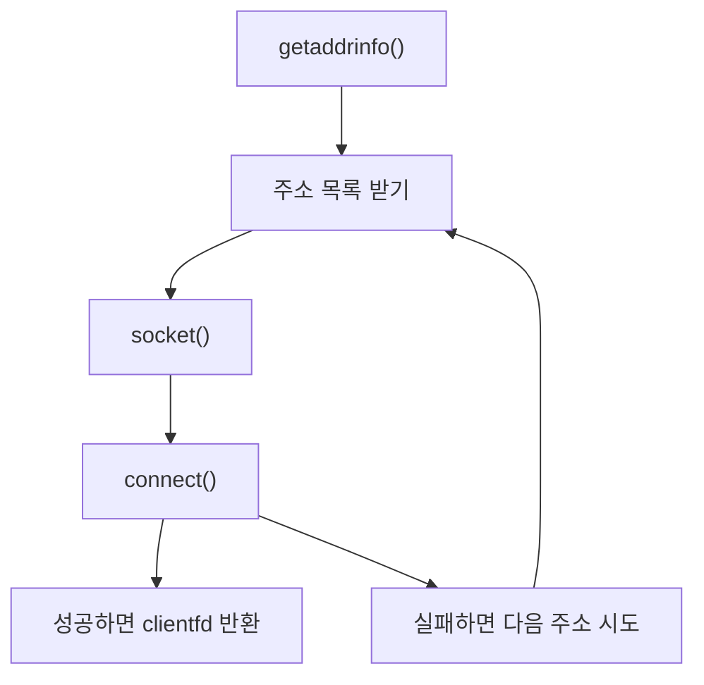

# echo 서버 학습 노트

## 목차
- [1. fd](#1-fd)
- [2. echo_client 코드 분석](#2-echo_client-코드-분석)
- [3. echo_server 코드 분석](#3-echo_server-코드-분석)
- [4. open_clientfd 코드 흐름](#4-open_clientfd-코드-흐름)

---

# 1. fd

## 1.1 fd란 무엇인가

- `fd`는 `file descriptor`의 줄임말이다.
- 프로세스가 여는 I/O 자원에 붙는 정수 번호다.
- 코드에서는 그냥 `int`처럼 보이지만, 실제로는 커널 안의 자원을 가리키는 손잡이 역할을 한다.

## 1.2 fd가 붙는 대상

- 파일: `open()`
- 파이프: `pipe()`
- 표준 입출력: `0(stdin)`, `1(stdout)`, `2(stderr)`
- 소켓: `socket()`, `accept()`, `open_clientfd()`

## 1.3 왜 fd가 필요한가

- 프로세스는 커널의 자원을 직접 만지지 못한다.
- 대신 `fd`를 통해 커널이 관리하는 대상을 간접적으로 사용한다.
- 같은 `fd` 번호가 다른 프로세스에서는 전혀 다른 자원을 가리킬 수 있다.

## 1.4 listen socket과 accepted socket



- 서버는 `listen socket` 1개로 연결 요청을 기다린다.
- 클라이언트가 연결하면 `accept()`가 새 소켓을 하나 만든다.
- 이 새 소켓이 `accepted socket`이다.
- 따라서 서버는 하나의 `listen socket`과 여러 개의 `accepted socket`을 동시에 가진다.

## 1.5 fd와 커널 자원



- 프로세스는 `fd`를 가진다.
- 커널은 `fd table`을 통해 실제 소켓 객체를 찾는다.
- 소켓 객체 안에는 주소, 연결 상태, 버퍼 정보가 들어 있다.

---

# 흐름


# 2. echo_client 코드 분석

## 2.1 이 프로그램이 하는 일

- 사용자가 입력한 문자열을 서버로 보낸다.
- 서버가 같은 문자열을 다시 돌려주면 화면에 출력한다.
- 그래서 이름이 `echo_client`이다.

## 2.2 `argc`와 `argv`

```c
if (argc != 3) {
    fprintf(stderr, "usage: %s <host> <port>\n", argv[0]);
    return 1;
}
```

- `argc`는 명령행 인자 개수다.
- `argv[0]`는 실행 파일 이름이다.
- `argv[1]`은 `host`다.
- `argv[2]`는 `port`다.

예시:

```bash
./echo_client example.com 8080
```

- `argv[0] = "./echo_client"`
- `argv[1] = "example.com"`
- `argv[2] = "8080"`

## 2.3 `host`와 `port`

- `host`는 서버 주소 문자열이다.
- `port`는 서버가 기다리는 포트 번호 문자열이다.
- `open_clientfd(host, port)`는 이 둘을 이용해서 실제 연결을 만든다.

## 2.4 `open_clientfd` 호출

```c
clientfd = Open_clientfd(host, port);
```

- 성공하면 `clientfd`는 연결된 소켓의 `fd`가 된다.
- 실패하면 음수 값을 돌려준다.

## 2.5 데이터 루프

```c
while (fgets(buf, MAXLINE, stdin) != NULL) {
    Rio_writen(clientfd, buf, strlen(buf));
    if (Rio_readlineb(&rio, buf, MAXLINE) > 0) {
        Fputs(buf, stdout);
    } else {
        break;
    }
}
```

- `fgets()`가 사용자 입력을 읽는다.
- `Rio_writen()`이 서버로 보낸다.
- `Rio_readlineb()`가 서버 응답을 읽는다.
- `Fputs()`가 화면에 출력한다.



---

# 3. echo_server 코드 분석

## 3.1 이 프로그램이 하는 일

- 클라이언트가 보낸 데이터를 읽는다.
- 읽은 데이터를 그대로 다시 보낸다.
- 그래서 이름이 `echo server`이다.

## 3.2 서버 함수들

- `main()`: 서버 시작점이다. 소켓을 만들고 연결을 기다린다.
- `Open_listenfd(host, port)`: 서버가 연결 요청을 받을 수 있도록 `socket()`, `bind()`, `listen()`을 수행한다.
- `Accept(listenfd, ...)`: 연결 요청을 하나 받아서 클라이언트 전용 연결 소켓을 만든다.
- `Echo(connfd)`: 클라이언트가 보낸 데이터를 읽고 그대로 다시 보낸다.
- `Rio_readinitb(&rio, connfd)`: 읽기 버퍼를 초기화한다.
- `Rio_readlineb(&rio, buf, MAXLINE)`: 한 줄씩 읽는다.
- `Rio_writen(connfd, buf, n)`: 읽은 데이터를 다시 쓴다.
- `Close(connfd)`: 연결 소켓을 닫는다.

### `echo server` 흐름



### 핵심 정리

- 서버는 `listenfd`로 연결 요청을 기다린다.
- `accept()`로 클라이언트별 `connfd`가 생긴다.
- `Echo()`는 `connfd`를 이용해서 읽고 다시 쓰는 루프를 돈다.
- `Rio_readlineb()`로 한 줄 읽고 `Rio_writen()`으로 같은 내용을 다시 보낸다.
- 에코 서버는 “받은 걸 그대로 돌려주는 서버”를 이해하기 좋은 예제다.

# 4. open_clientfd 코드 흐름

## 4.1 전체 흐름



## 4.2 왜 주소 목록이 필요한가

- `host`는 하나의 IP가 아닐 수 있다.
- IPv4와 IPv6가 함께 있을 수 있다.
- DNS 결과가 여러 개면 그중 하나를 차례대로 시도해야 한다.

## 4.3 실패 처리

- `socket()`이 실패하면 다음 시도로 넘어간다.
- `connect()`가 실패하면 `close()`하고 다음 주소를 시도한다.
- 모든 시도가 실패하면 에러를 돌려준다.

## 4.4 핵심 정리

- `fd`는 프로세스가 커널 자원을 쓰기 위한 번호다.
- `listen socket`은 연결 요청을 받는 창구다.
- `accepted socket`은 실제로 한 클라이언트와 통신하는 소켓이다.
- `echo_client`는 입력한 문자열을 서버에 보내고 다시 받는 구조를 공부하기 좋은 예제다.
