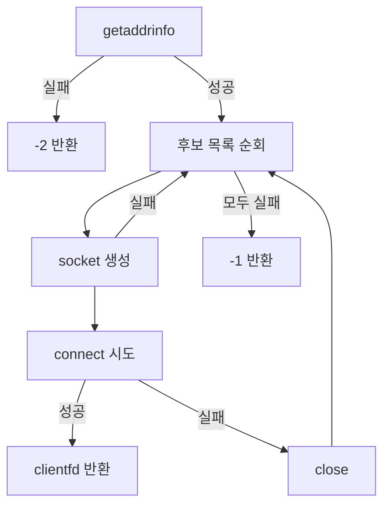

# echo 서버 학습 노트

## 목차
- [1. fd](#1-fd)
- [2. echo_client 소스코드 분석](#2-echo_client-%EC%86%8C%EC%8A%A4%EC%BD%94%EB%93%9C-%EB%B6%84%EC%84%9D)

---

# 1. fd
> 대분류 요약: 파일 디스크립터(`fd`)는 정수처럼 보이지만, 커널이 관리하는 I/O 자원 접근 키다.
> 학습 포인트: 정수 값과 실제 소켓 객체의 관계를 분리해서 보기.

<div style="height: 2px; background: linear-gradient(90deg, #666, #ddd); margin: 10px 0 20px 0;"></div>

## 1.1 fd는 무엇인가
- `fd`(File Descriptor)는 운영체제가 열려 있는 I/O 자원(파일, 소켓, 파이프, 터미널 등)에 부여하는 **정수형 식별자**다.
- fd 자체는 자원 자체가 아니라, 커널 내부 객체를 가리키는 **핸들(식별 키)**이다.
- 즉, “`fd` 값”은 번호이고, 실제 동작은 커널이 그 번호를 통해 자원 객체를 찾아 수행한다.

## 1.2 fd는 소켓만이 아니다
- 파일: `open(...)` 결과
- 파이프: `pipe()` 결과
- 표준 입출력: `0(stdin)`, `1(stdout)`, `2(stderr)`
- 소켓: `socket()`, `accept()`, `Open_clientfd()` 결과
- 따라서 `fd`는 범용 I/O 자원 식별자다.

## 1.3 소켓 맥락에서 fd를 이해하기
- 소켓을 위한 `connect`, `read`, `write`, `close`는 모두 fd를 받아 동작한다.
- `open_clientfd`가 성공하면 반환하는 값 `clientfd`는 “연결된 소켓 객체를 가리키는 정수형 핸들”이다.
- 사용 완료 후 `Close(clientfd)`로 해제해야 자원 누수를 막는다.

## 1.4 `fd`가 “가리키는 값”처럼 보이는 이유
- `fd`는 `int`이므로 보통 “정수 번호”로 보이지만, 의미상 커널 객체의 참조 포인트다.
- 같은 `fd` 번호를 통해 이후 I/O 호출들이 동일한 자원을 다룬다.
- `fd`는 정수 연산 대상이 아니라, 커널이 해석해야 하는 **자원 식별 토큰**이다.

## 1.5 `host`, `port`, `fd` 연결 관점으로 한 줄 정리
- `host`/`port`는 문자열 포인터이고, `clientfd`는 정수형 식별자이다.
- 문자열 인자를 해석해 네트워크 주소를 찾고, 그 결과로 연결된 소켓 fd를 얻는 흐름이다.

---

# 2. echo_client 소스코드 분석
> 대분류 요약: `argv` 문자열 포인터(`host`, `port`)가 어떻게 소켓 연결(`fd`)로 이어지는지 순서대로 본다.
> 학습 포인트: `argc/argv` 구조 → `open_clientfd` 연결 생성 → 입출력 루프.

<div style="height: 2px; background: linear-gradient(90deg, #666, #ddd); margin: 10px 0 20px 0;"></div>

## 2.1 핵심 질문

`echo_client`는 `./echo_client <host> <port>`로 실행되며, `argv`에서 문자열 인자를 받아 소켓을 열고 서버와 통신한다.

## 2.2 `argc/argv` 검증 코드

```c
if (argc != 3) {
    fprintf(stderr, "usage: %s <host> <port>\n", argv[0]);
    return 1;
}
```

- `argc`는 “실행 파일 이름 포함 전체 인자 개수”
  - `argv[0]`: 실행 파일명
  - `argv[1]`: host
  - `argv[2]`: port
- 사용자 입력은 `host`, `port` 2개지만, `argc`는 3이어야 통과한다.
- 즉, “사용자 입력 2개” + “프로그램명 1개” = 총 3개.

## 2.3 `host`/`port` 포인터로 받는 이유

```c
const char *host = argv[1]; // 명령행에서 전달된 host 문자열 시작 주소
const char *port = argv[2]; // 명령행에서 전달된 port 문자열 시작 주소(숫자 문자열)
```

- `argv`는 `char **`라서, 각 `argv[i]`는 문자열의 시작 주소다.
- 따라서 `host`, `port`는 문자열 자체를 복사하는 게 아니라 **주소를 받아 참조**한다.
- 즉 `host`는 `"example.com"`의 첫 글자 `'e'` 위치 주소, `port`는 `"8080"`의 첫 글자 `'8'` 위치 주소.

## 2.4 예시: 실행 시 `argv` 구성

실행:
```bash
./echo_client example.com 8080
```

내부 값:
- `argc = 3`
- `argv[0] = "./echo_client"`
- `argv[1] = "example.com"`
- `argv[2] = "8080"`
- `argv[3] = NULL`

## 2.5 문자열 값 접근 방식 (주소와 문자)

- `host`는 문자열 전체가 아니라 시작 주소를 담는다.
- `argv[1][0] == 'e'`, `argv[2][0] == '8'`처럼 문자 단위 인덱싱이 가능하다.
- `host[1]`은 `"example.com"`의 두 번째 문자 `'x'`를 가리킨다.

## 2.6 `argv` 값과 주소를 동시에 보는 예시

실행:
```bash
./echo_client example.com 8080
```

개념 배열(`argv`)의 값:
```c
argv[0] = "./echo_client"
argv[1] = "example.com"
argv[2] = "8080"
argv[3] = NULL
```

메모리 느낌(가상 주소 포함):
```text
argv (char **) = 0x7ffdfc20

0x7ffdfc20 -> 0x7ffdfc40   // argv[0] 주소(포인터 값)
0x7ffdfc28 -> 0x7ffdfc60   // argv[1] 주소
0x7ffdfc30 -> 0x7ffdfc70   // argv[2] 주소
0x7ffdfc38 -> 0x00000000   // argv[3] = NULL

[0x7ffdfc40] = "./echo_client\0"
[0x7ffdfc60] = "example.com\0"
[0x7ffdfc70] = "8080\0"
```

핵심 포인트:
- `argv`는 `char**` → 포인터들의 배열(배열 요소는 문자열 시작 주소)
- `argv[1]`은 `"example.com"` 문자열의 시작 주소
- `host = argv[1];`는 문자열을 복사한 게 아니라 같은 시작 주소를 공유
- `*argv[1]` 또는 `argv[1][0]`은 `'e'`, `argv[2][0]`은 `'8'`을 읽음

```c
char *host = argv[1];
char *port = argv[2];
// host 는 "example.com"의 e 주소, port는 "8080"의 8 주소를 가리킴
```

## 2.6 `open_clientfd` 호출 및 반환

```c
clientfd = Open_clientfd(host, port);
```

- `clientfd`가 0보다 크면 연결된 소켓 fd 획득 성공.
- `<0`이면 실패.

## 2.7 `open_clientfd` 핵심 동작 정리 (CS:APP 패턴)

```c
/* $begin open_clientfd */
int open_clientfd(char *hostname, char *port) {
    int clientfd, rc;
    struct addrinfo hints, *listp, *p;

    memset(&hints, 0, sizeof(struct addrinfo));
    hints.ai_socktype = SOCK_STREAM;
    hints.ai_flags = AI_NUMERICSERV;
    hints.ai_flags |= AI_ADDRCONFIG;

    if ((rc = getaddrinfo(hostname, port, &hints, &listp)) != 0) {
        fprintf(stderr, "getaddrinfo failed (%s:%s): %s\n", hostname, port, gai_strerror(rc));
        return -2;
    }

    for (p = listp; p; p = p->ai_next) {
        if ((clientfd = socket(p->ai_family, p->ai_socktype, p->ai_protocol)) < 0)
            continue;

        if (connect(clientfd, p->ai_addr, p->ai_addrlen) != -1)
            break;

        if (close(clientfd) < 0) {
            fprintf(stderr, "open_clientfd: close failed: %s\n", strerror(errno));
            return -1;
        }
    }

    freeaddrinfo(listp);
    if (!p)
        return -1;
    else
        return clientfd;
}
/* $end open_clientfd */
```

### 2.7.1 핵심 흐름
1. `getaddrinfo`로 서버 주소 후보 리스트를 얻는다.
2. 후보를 하나씩 반복한다.
   - `socket()` 생성
   - `connect()` 시도
   - 성공하면 그 `fd`를 바로 반환한다.
   - 실패하면 `close()`하고 다음 후보로 간다.
3. 끝까지 실패하면 `-1`.
4. `getaddrinfo` 자체 실패는 `-2`.



### 2.7.2 왜 후보 순회가 중요한가
- IPv4/IPv6 등 여러 주소가 있을 수 있으므로, 하나만 고정하지 않고 순회해 연결 안정성을 높인다.
- 실패 자원(`socket` fd)은 즉시 `close`로 회수한다.

## 2.8 echo_client 데이터 루프

```c
while (fgets(buf, MAXLINE, stdin) != NULL) {
    Rio_writen(clientfd, buf, strlen(buf));
    if (Rio_readlineb(&rio, buf, MAXLINE) > 0) {
        Fputs(buf, stdout);
    } else {
        break;
    }
}
```

- 사용자가 입력하면 서버로 전송(`Rio_writen`)
- 서버에서 한 줄 응답 수신(`Rio_readlineb`) 후 화면 출력(`Fputs`)
- EOF 또는 종료 응답이 오면 루프 종료

## 2.9 핵심 정리
- `argv`는 실행명까지 포함한 문자열 포인터 배열.
- `host`, `port`는 그 배열의 문자열 시작 주소를 담는 `char*` 포인터.
- `open_clientfd`는 이 문자열을 바탕으로 주소 해석 후 소켓을 만들어 정수형 `fd`를 돌려준다.
- `fd`는 커널 소켓 객체를 가리키는 참조로 사용된다.
