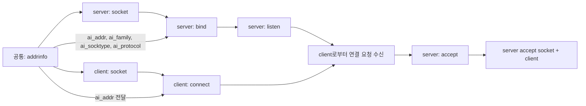

# 소켓 정리
- 질문: 소켓이 뭐고, 왜 필요한가?
- 답: 소켓은 네트워크 통신을 위한 OS의 통신 인터페이스다.
- 내가 정리한 내용:
  1) 연결 상태(연결·해제·재전송·버퍼·타임아웃·에러 처리) 같은 통신 상태를 관리한다.
  2) 포트 기반으로 식별할 수 있다.
  3) 소켓은 물리 입구가 아니라, OS가 앱에 제공하는 파일 핸들 같은 통신 인터페이스이다.


## 1. 클라이언트 3개일 때 소켓 흐름


- 질문: 클라이언트가 3개면 서버 입장에서는 소켓이 총 몇 개인가?
- 답: 서버 입장에서는 `listen` 소켓 1개와 `accept` 소켓 3개가 필요하므로 총 4개다. 전체 시스템 기준으로는 클라이언트 소켓 3개가 더해진다.


- 질문: `listen` 소켓과 `accept` 소켓의 차이는 무엇인가?
- 답: `listen` 소켓은 연결 요청을 받는 대기용이고, `accept` 소켓은 특정 클라이언트 1명과 실제 통신하는 용도다. 그래서 서버는 `socket() -> bind() -> listen() -> accept()` 흐름으로 동작한다.

- 질문: 소켓 하나로 `listen` 역할과 `accept` 역할을 같이 못 하는 이유는 무엇인가?
- 답: `listen` 소켓은 누가 올지 모르는 연결 요청을 받는 역할이고, `accept` 소켓은 이미 연결된 특정 클라이언트와 통신하는 역할이라서 필요한 상태가 다르다. TCP는 클라이언트마다 연결 상태가 따로 필요하므로 둘을 분리한다.

### 소켓 흐름 그림

```text
서버
  socket()
    |
  bind()
    |
  listen()  ---- 대기용 소켓 1개
    |
    +--> accept() -> 연결 소켓 1 -> client 1
    |
    +--> accept() -> 연결 소켓 2 -> client 2
    |
    +--> accept() -> 연결 소켓 3 -> client 3

클라이언트
  client 1: socket() -> connect()
  client 2: socket() -> connect()
  client 3: socket() -> connect()
```

### 정리

- `listen` 소켓은 연결 요청을 받는 대기용이다.
- `accept` 소켓은 특정 클라이언트 1명과 실제 통신하는 용도다.
- 클라이언트가 3개면 서버는 `listen` 소켓 1개를 유지하면서 `accept` 소켓 3개를 따로 만든다.


## 2. addrinfo 구조체 분석

- 질문: `struct addrinfo`는 뭘 담는 구조체인가?
- 답: 소켓을 만들기 전에, "어떤 주소/포트/프로토콜로 통신할지"를 지정하는 정보 묶음이다. 소켓 그 자체가 아니라 소켓 생성/연결/바인드에 쓰는 입력 정보라고 보면 된다.

`struct addrinfo` 선언(네가 준 내용 그대로):
```
struct addrinfo
{
  int ai_flags;            /* Input flags.  */
  int ai_family;           /* Protocol family for socket.  */
  int ai_socktype;         /* Socket type.  */
  int ai_protocol;         /* Protocol for socket.  */
  socklen_t ai_addrlen;    /* Length of socket address.  */
  struct sockaddr *ai_addr; /* Socket address for socket.  */
  char *ai_canonname;      /* Canonical name for service location.  */
  struct addrinfo *ai_next; /* Pointer to next in list.  */
};
```

각 필드 의미 + 예시:
1) `ai_flags`
- 의미: `getaddrinfo()`가 동작할 때의 옵션.
- 예시: `AI_PASSIVE`를 쓰면 서버 바인딩용 주소를 얻을 때 `NULL` 호스트에서 wildcard 바인드를 허용.

2) `ai_family`
- 의미: 주소 패밀리(IPv4/IPv6 선택).
- 예시: `AF_INET`이면 IPv4 주소, `AF_INET6`이면 IPv6 주소, `AF_UNSPEC`이면 시스템이 둘 다 후보로 줌.

3) `ai_socktype`
- 의미: 소켓 타입.
- 예시: `SOCK_STREAM`은 연결형(TCP), `SOCK_DGRAM`은 비연결형(UDP) 후보를 찾을 때 사용.

4) `ai_protocol`
- 의미: 위 소켓 타입과 조합할 실제 프로토콜.
- 예시: TCP면 `IPPROTO_TCP`, UDP면 `IPPROTO_UDP`를 지정.

5) `ai_addrlen`
- 의미: `ai_addr`가 가리키는 주소 구조체의 바이트 크기.
- 예시: IPv4면 보통 `sockaddr_in` 크기, IPv6면 `sockaddr_in6` 크기.

6) `ai_addr`
- 의미: 실제 주소값이 들어 있는 구조체 포인터.
- 예시: 클라이언트가 `connect()` 할 때 `connect(fd, ai_addr, ai_addrlen)`에 그대로 전달.

7) `ai_canonname`
- 의미: 정규화된(정식) 호스트명.
- 예시: 입력 호스트가 별칭/short name이면, 정식 호스트명 문자열이 들어올 수 있음.

8) `ai_next`
- 의미: 다음 후보 주소를 가리키는 링크.
- 예시: IPv4와 IPv6가 모두 가능할 때 첫 번째 시도 실패 시 다음 노드로 넘어가서 다시 연결 시도.

- 질문: 소켓을 만들고 서버/클라이언트에 붙이는 구조를 한눈에 보고 싶어
- 답: 아래처럼 보자.



- 질문: 서버 측 함수들(`socket`, `bind`, `listen`, `accept`, `close`)은 각각 어떤 동작을 하나?
- 답: 흐름은 `소켓 생성 -> 주소 바인딩 -> 수신 대기 -> 연결 수락 -> 정리`로 보면 된다.

함수별 동작:
1) `socket()`
- 동작: 통신용 소켓 객체를 OS에 생성하고 핸들(소켓 FD)을 받는다.
- 생각: "통신을 위한 빈 통로를 만든다."

2) `bind()`
- 동작: 생성한 소켓에 내 로컬 IP/포트(예: `0.0.0.0:8080`)를 등록한다.
- 생각: "이 주소로 들어오는 요청을 내가 받겠다는 약속을 등록"

3) `listen()`
- 동작: 바인딩된 TCP 소켓을 수동 연결 수신 모드로 전환한다.
- 생각: "요청이 오기를 대기하는 상태로 전환"

4) `accept()`
- 동작: 대기 큐에서 하나의 클라이언트 연결을 꺼내 새 소켓을 생성해 준다.
- 생각: "새 연결용 소켓(통신 전용)을 할당"

5) `close()`
- 동작: 소켓 FD를 닫고 연결/자원을 정리한다.
- 생각: "통신 끝. OS 자원 회수"

한줄 요약:
- `socket`은 생성, `bind`는 내 주소 배정, `listen`은 수신 대기 모드 전환, `accept`는 실제 접속 처리, `close`는 정리.

- 질문: `sockaddr`는 여러 주소 구조체를 받기 위한 공통 포장지라는 말은 무슨 뜻인가?
- 답: `bind()`나 `connect()` 같은 함수는 IPv4, IPv6처럼 서로 다른 주소 구조체를 공통된 형태로 받기 위해 `struct sockaddr *`를 사용한다. 실제 데이터는 `sockaddr_in`이나 `sockaddr_in6`에 들어 있고, 함수에 넘길 때만 공통 타입으로 형변환해서 보여준다. 형변환은 내용을 바꾸는 게 아니라, 함수가 받을 수 있는 모양으로 포인터 타입만 맞추는 것이다.
