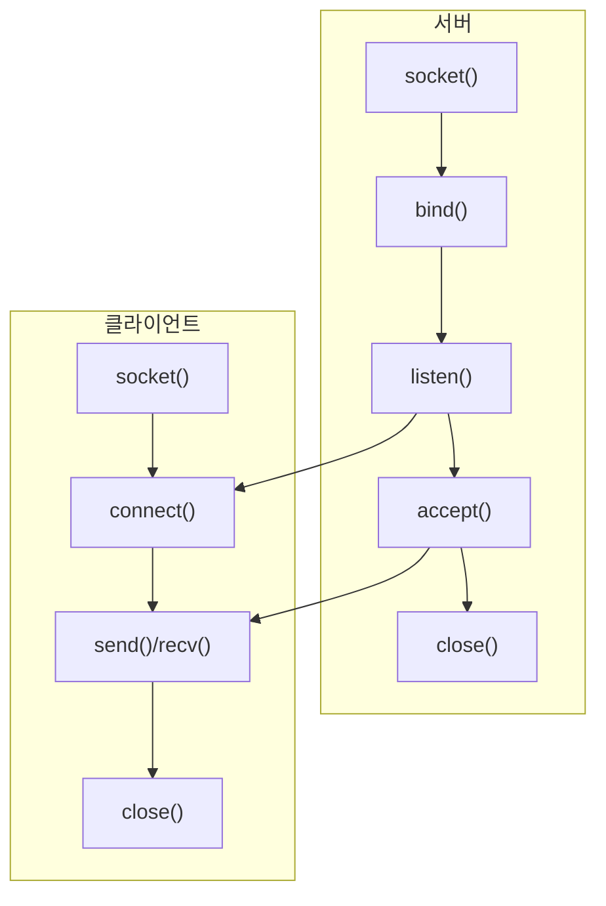
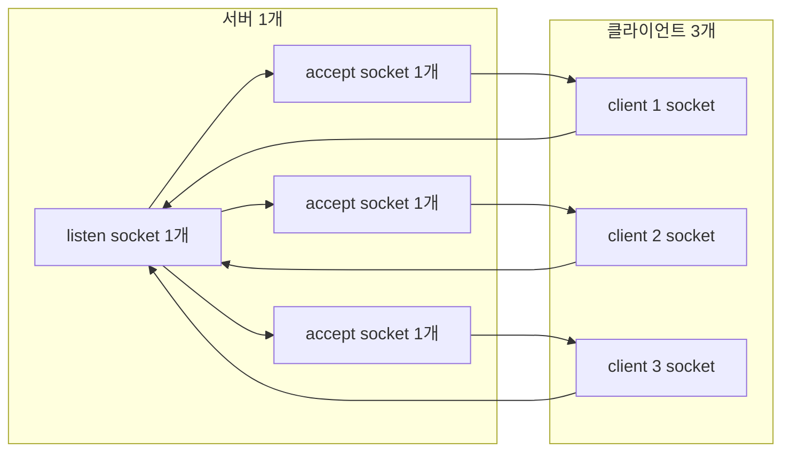
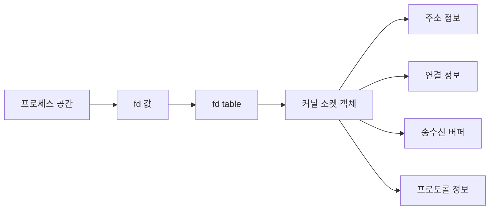
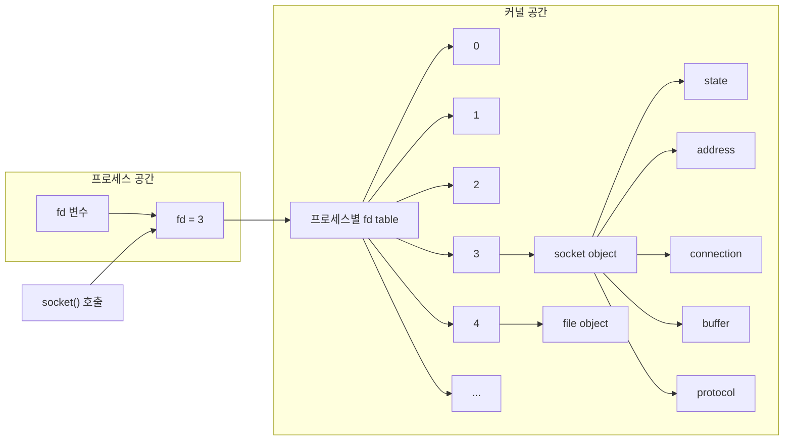
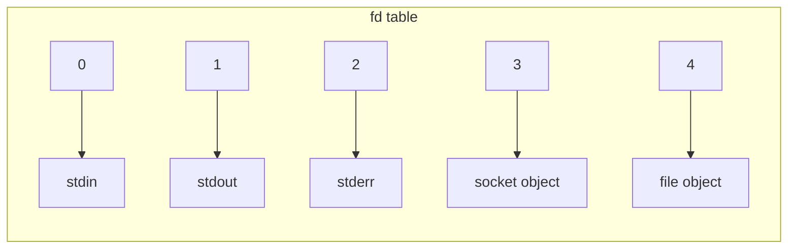
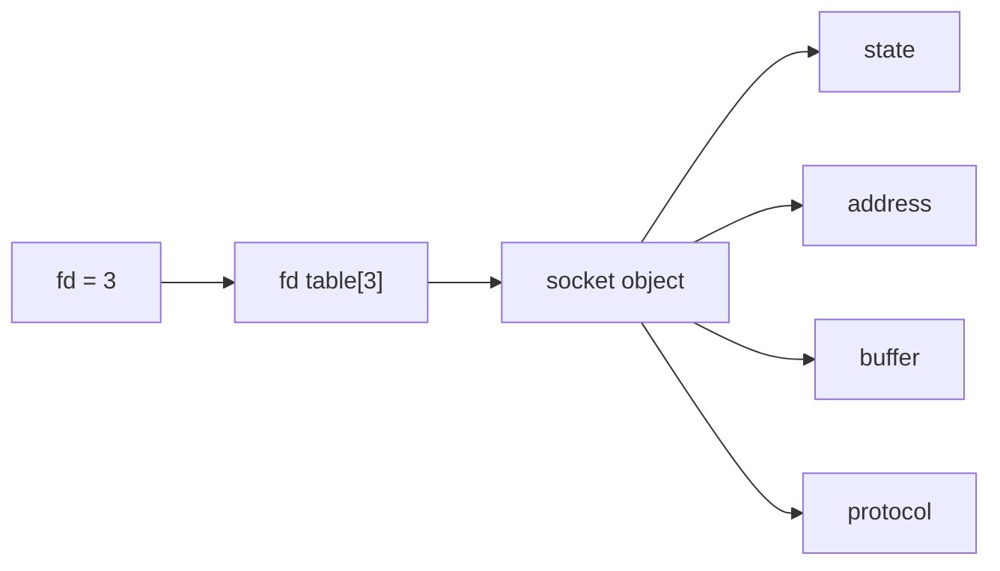

# 소켓 정리

## 목차
- 0. 소켓이 뭐고 왜 필요한가
- 2.1 소켓 자원은 어떻게 보이는가
- 4. 소켓 함수 기초
- 기본 역할
- 기본 흐름
- 한 줄 정리
- 3.1 `socket()` 실행 시 메모리 변화
- 3.2 `fd table` 모양과 자료구조
- `addrinfo` 구조체
- 필드 의미
- `sockaddr`와 실제 주소 구조체
- 1. 서버와 클라이언트 흐름
- 1.1 클라이언트 함수
- 1.2 서버 함수
- `listen` 소켓과 `accept` 소켓 차이
- 1.3 클라이언트가 여러 개일 때
## 0. 소켓이 뭐고 왜 필요한가

- 소켓은 네트워크 통신을 위한 OS의 통신 인터페이스다.
- 연결 상태, 포트 기반 식별, 송수신 같은 통신 과정을 OS가 관리하게 해준다.
- 물리 입구가 아니라, 프로그램이 네트워크와 연결되는 창구다.

## 1. 서버와 클라이언트 흐름



## 1.1 클라이언트 함수

- `socket()`: 통신용 소켓 객체를 만든다.
- `connect()`: 서버 주소로 연결을 시도한다.
- `send()`: 연결된 서버로 데이터를 보낸다.
- `recv()`: 서버가 보낸 데이터를 받는다.
- `close()`: 소켓과 연결된 자원을 정리한다.

## 1.2 서버 함수

- `socket()`: 통신용 소켓 객체를 만든다.
- `bind()`: 소켓에 로컬 IP와 포트를 붙인다.
- `listen()`: 연결 요청을 받는 대기 상태로 바꾼다.
- `accept()`: 대기 중인 연결 하나를 꺼내 실제 통신용 소켓을 만든다.
- `close()`: 소켓과 연결된 자원을 정리한다.

### `listen` 소켓과 `accept` 소켓 차이

- `listen` 소켓은 연결 요청을 받는 대기용이다.
- `accept` 소켓은 특정 클라이언트 1명과 실제 통신하는 용도다.
- TCP는 클라이언트마다 연결 상태가 따로 필요해서 둘을 분리한다.

## 1.3 클라이언트가 여러 개일 때



- 서버는 `listen` 소켓 1개를 유지한다.
- 클라이언트가 3개면 `accept` 소켓도 3개가 생긴다.
- 서버 입장에서는 `listen` 소켓 1개 + `accept` 소켓 3개 = 총 4개다.
- 전체 시스템 기준으로는 클라이언트 소켓 3개까지 더해진다.

---
## 소켓
## 2.1 소켓 자원은 어떻게 보이는가



- 프로세스는 `fd`라는 정수값을 가진다.
- `fd`는 커널의 `fd table`을 통해 소켓 객체를 찾아간다.
- 커널의 소켓 객체 안에는 주소 정보, 연결 정보, 송수신 버퍼, 프로토콜 정보가 들어 있다.
- 그래서 소켓은 단순한 번호가 아니라, 커널이 관리하는 통신 자원이라고 보면 된다.
- 학습용으로는 `fd`를 인덱스, `fd table`을 배열처럼 봐도 된다.
- 다만 실제 구현을 정확히 따지면 단순한 C 배열이라고 단정하기보다, 인덱스로 바로 접근하는 테이블에 가깝다고 보는 게 안전하다.
## 2-2. 소켓 함수와 소켓 도움함수 (인자/반환값/코드 분석)

### A. 표준 소켓 API

| 함수 | 인자 | 반환값 |
|---|---|---|
| `socket(domain, type, protocol)` | `domain`: `AF_INET`/`AF_INET6` / `type`: `SOCK_STREAM`/`SOCK_DGRAM` / `protocol`: `IPPROTO_TCP`/`IPPROTO_UDP` | 성공 시 `fd` (양수), 실패 시 `-1` |
| `bind(sockfd, my_addr, addrlen)` | `sockfd`: `socket()` 반환값 / `my_addr`: 바인딩할 주소 / `addrlen`: 주소 구조체 길이 | 성공 시 `0`, 실패 시 `-1` |
| `listen(sockfd, backlog)` | `sockfd`: listen 용도로 쓰는 소켓 / `backlog`: 동시 대기 큐 크기 | 성공 시 `0`, 실패 시 `-1` |
| `accept(sockfd, addr, addrlen)` | `sockfd`: listen 소켓 / `addr`: 클라 주소 출력 버퍼 / `addrlen`: 주소 길이 포인터 | 성공 시 새 `connfd`, 실패 시 `-1` |
| `connect(sockfd, serv_addr, addrlen)` | `sockfd`: 클라이언트 소켓 / `serv_addr`: 서버 주소 / `addrlen`: 주소 길이 | 성공 시 `0`, 실패 시 `-1` |
| `close(fd)` | `fd`: 닫을 파일/소켓 디스크립터 | 성공 시 `0`, 실패 시 `-1` |

### B. CSAPP 래퍼 계층 (`csapp.h`, `csapp.c`)

```c
int Socket(int domain, int type, int protocol);     // socket() 래퍼
void Bind(int sockfd, struct sockaddr *my_addr, int addrlen);
void Listen(int s, int backlog);
int  Accept(int s, struct sockaddr *addr, socklen_t *addrlen);
void Connect(int sockfd, struct sockaddr *serv_addr, int addrlen);
```

- 래퍼의 공통 포인트
  - 반환값/에러 처리 정책이 통일되어 있음
  - 실패하면 `unix_error()`로 종료 처리
  - 본문은 `csapp.c`에서 `if (rc = xxx(...) < 0) unix_error("...")` 형태

```c
// csapp.c
int Socket(int domain, int type, int protocol) 
{
    int rc;

    if ((rc = socket(domain, type, protocol)) < 0)
	unix_error("Socket error");
    return rc;
}
```

- `Bind/Listen/Connect`는 반환값이 `0`이 성공인데, 래퍼를 사용하면 실패 시 즉시 종료됨
- `Accept`는 실패 시 리턴을 검사한 뒤 `unix_error`를 호출해 즉시 종료
- `Listen`/`Connect` 자체가 성공 시 `void`를 반환하지만, 실패 가능 호출은 내부에서 처리됨

### B-1. 래퍼 이전의 진짜 소켓(시스템 호출 기준)

- 진짜 소켓 함수를 먼저 구분하면 `socket()`, `bind()`, `listen()`, `accept()`, `connect()`, `close()`는 운영체제 커널 시스템 호출에 직접 접근하는 API다.
- 즉, `Socket()`/`Bind()` 같은 함수는 네 코드와 커널 사이에 있는 **편의 래퍼일 뿐**, 실제 동작은 아래 커널 호출들과 동일한 의미로 이뤄진다.

```c
int fd = socket(AF_INET, SOCK_STREAM, 0);
int rc = bind(fd, (SA *)&myaddr, sizeof(myaddr));
rc = listen(fd, LISTENQ);
int connfd = accept(fd, (SA *)&clientaddr, &clientlen);
rc = connect(fd, (SA *)&servaddr, servaddr_len);
rc = close(fd);
```

- `socket()` 이전값: 핵심은 `프로토콜 도메인/타입/프로토콜`을 커널이 해석해서 커널 내부 소켓 객체를 생성
- `bind()` 이전값: `sockfd`가 `sin_port/sin_addr`를 가진 주소와 연결되도록 요청 (정책 위반이면 실패)
- `listen()` 이전값: listen 소켓을 연결 대기 모드로 전환
- `accept()` 이전값: 대기 큐에서 하나 꺼내 실제 통신용 새 fd(`connfd`)를 생성해 반환
- `connect()` 이전값: 3-way handshake 절차로 상대와 연결 시도(성공/실패 반환)
- `close()` 이전값: fd와 연결된 커널 자원 참조 카운트를 내려 해당 엔트리/연결을 회수

- 가장 중요한 포인트
  - 래퍼는 **에러 처리(`unix_error`)를 붙인 버전**
  - 진짜 함수는 **반환값을 검사해서 직접 분기**해야 함
  - 진짜 의미상 `errno`는 커널/시스템 호출 실패 이유를 전달

```c
// 진짜 socket 호출 스타일
int fd = socket(AF_INET, SOCK_STREAM, 0);  // fd: 실패면 -1, 성공이면 0보다 큰 정수
if (fd < 0) {
    perror("socket");
    return -1;
}

if (bind(fd, (SA *)&myaddr, sizeof(myaddr)) < 0) {
    perror("bind");
    close(fd);
    return -1;
}
```

- echo_client/echo_server에서 실제 호출 경로는 보통 이렇게 된다
  - 클라: `Open_clientfd` → 내부에서 `socket()` + `connect()`(실패하면 close 후 다음 후보)
  - 서버: `Open_listenfd` → 내부에서 `socket()` + `setsockopt()` + `bind()` + `listen()`
  - 실제 수락: `Accept()` 래퍼 → 내부 `accept()` 호출

### C. 프로토콜 독립 헬퍼 (`open_clientfd`, `open_listenfd`)

```c
int open_clientfd(char *hostname, char *port);
int open_listenfd(char *port);
```

- `open_clientfd`는 `hostname, port`로 후보 주소를 받아서 다음을 반복
  1. `getaddrinfo(hostname, port, &hints, &listp)`
  2. 각 후보마다 `socket()`
  3. `connect()` 성공하면 즉시 리턴
  4. 실패하면 `close()`하고 다음 후보 시도
- 반환 규칙
  - `getaddrinfo` 실패: `-2`
  - 모든 후보 실패: `-1`
  - 연결 성공: 연결된 소켓 `fd`

```c
int open_clientfd(char *hostname, char *port) {
    int clientfd, rc;
    struct addrinfo hints, *listp, *p;

    memset(&hints, 0, sizeof(struct addrinfo));
    hints.ai_socktype = SOCK_STREAM;
    hints.ai_flags = AI_NUMERICSERV;
    hints.ai_flags |= AI_ADDRCONFIG;
    if ((rc = getaddrinfo(hostname, port, &hints, &listp)) != 0) {
        fprintf(stderr, "getaddrinfo failed (%s:%s): %s\n", hostname, port, gai_strerror(rc));
        return -2;
    }

    for (p = listp; p; p = p->ai_next) {
        if ((clientfd = socket(p->ai_family, p->ai_socktype, p->ai_protocol)) < 0) 
            continue;
        if (connect(clientfd, p->ai_addr, p->ai_addrlen) != -1) 
            break;
        if (close(clientfd) < 0) return -1;
    }
    freeaddrinfo(listp);
    if (!p) return -1;
    else    return clientfd;
}
```

- 에코 클라이언트에서 사용:
  - `int clientfd = Open_clientfd(host, port);`
  - `Open_clientfd`는 `open_clientfd`를 래핑해서 실패 시 `unix_error`로 종료

```c
// csapp.c
int Open_clientfd(char *hostname, char *port) {
    int rc;
    if ((rc = open_clientfd(hostname, port)) < 0)
	unix_error("Open_clientfd error");
    return rc;
}
```

### D. 서버용 listen 헬퍼

```c
int open_listenfd(char *port);
int Open_listenfd(char *port);
```

- `open_listenfd`의 동작
  1. `getaddrinfo(NULL, port, AI_PASSIVE|AI_ADDRCONFIG|AI_NUMERICSERV)`
  2. `socket()` 생성
  3. `setsockopt(SO_REUSEADDR)`로 TIME_WAIT 재시도 이슈 완화
  4. `bind()` 성공하면 루프 탈출
  5. `listen(listenfd, LISTENQ)`로 대기 소켓 완성
- 반환 규칙
  - `getaddrinfo` 실패: `-2`
  - bind/listen 실패 등: `-1`
  - 성공: listen 소켓 `fd`

```c
int open_listenfd(char *port) {
    struct addrinfo hints, *listp, *p;
    int listenfd, rc, optval=1;

    memset(&hints, 0, sizeof(struct addrinfo));
    hints.ai_socktype = SOCK_STREAM;
    hints.ai_flags = AI_PASSIVE | AI_ADDRCONFIG;
    hints.ai_flags |= AI_NUMERICSERV;
    if ((rc = getaddrinfo(NULL, port, &hints, &listp)) != 0) {
        fprintf(stderr, "getaddrinfo failed (port %s): %s\n", port, gai_strerror(rc));
        return -2;
    }
    for (p = listp; p; p = p->ai_next) {
        if ((listenfd = socket(p->ai_family, p->ai_socktype, p->ai_protocol)) < 0) 
            continue;
        setsockopt(listenfd, SOL_SOCKET, SO_REUSEADDR, (const void *)&optval , sizeof(int));
        if (bind(listenfd, p->ai_addr, p->ai_addrlen) == 0)
            break;
        if (close(listenfd) < 0) return -1;
    }
    freeaddrinfo(listp);
    if (!p) return -1;
    if (listen(listenfd, LISTENQ) < 0) {
        close(listenfd);
        return -1;
    }
    return listenfd;
}
```

- 에코 서버에서 사용:
  - `int listenfd = Open_listenfd(argv[1]);`
  - `connfd = Accept(listenfd, (SA *)&clientaddr, &clientlen);`

### E. Rio(robust I/O) 도움함수

- `rio_readinitb(rp, fd)`: `rp->rio_fd=fd`로 소켓/FD를 버퍼 객체에 바인딩하고 내부 카운터 초기화
- `rio_readlineb(rp, usrbuf, maxlen)`: 개행(`\n`) 단위/버퍼 기반 안정적 수신
- `rio_writen(fd, usrbuf, n)`: `write` 반복 호출로 `n` 바이트 전송 보장
- 래퍼형은 `Rio_readlineb`, `Rio_writen`으로 에러 종료 전략 통일

```c
void Rio_writen(int fd, void *usrbuf, size_t n) {
    if (rio_writen(fd, usrbuf, n) != n)
	unix_error("Rio_writen error");
}
```

- 읽기/쓰기 반환값 해석 팁
  - `n == 0`: EOF 또는 라인 끝(읽기 함수마다 다름)
  - `n > 0`: 실제 읽은 바이트 수
  - `< 0`: 오류

## 3.1 `socket()` 실행 시 메모리 변화



- `socket()`을 호출하면 프로세스에는 `fd`라는 정수값이 생긴다.
- 커널에는 소켓을 관리하기 위한 내부 정보가 생긴다.
- `fd`는 소켓 자체가 아니라, 커널의 `fd table`을 통해 소켓 정보를 찾는 번호다.
- 실제 소켓 자원은 커널 메모리에 있다.

## 3.2 `fd table` 모양과 자료구조



- `fd table`은 인덱스 기반 테이블
- `fd` 번호를 인덱스로 써서 바로 해당 엔트리를 찾는다.
- 예를 들어 `fd = 3`이면 `fd table[3]`을 보고 그 자원이 소켓인지 파일인지 찾는다.
- 그래서 학습용으로는 배열처럼 봐도 된다.
- 다만 실제 구현을 아주 엄밀하게 따지면 단순한 C 배열이라고 단정하지 말고, 인덱스로 바로 접근하는 테이블이라고 이해하는 게 안전하다.



- 소켓 객체는 상태, 주소, 연결 정보, 버퍼, 프로토콜 같은 내용을 들고 있다.
- 이 내용은 우리가 직접 쓰는 C 구조체라고 단정하기보다, 커널이 관리하는 내부 자료구조라고 보는 게 안전하다.

## `addrinfo` 구조체

`struct addrinfo`는 소켓을 만들기 전에 어떤 주소, 포트, 프로토콜로 통신할지 정하는 정보 묶음이다.

```c
struct addrinfo
{
  int ai_flags;
  int ai_family;
  int ai_socktype;
  int ai_protocol;
  socklen_t ai_addrlen;
  struct sockaddr *ai_addr;
  char *ai_canonname;
  struct addrinfo *ai_next;
};
```

### 필드 의미

- `ai_flags`: `getaddrinfo()` 동작 옵션
- `ai_family`: IPv4 또는 IPv6 같은 주소 패밀리
- `ai_socktype`: `SOCK_STREAM`, `SOCK_DGRAM` 같은 소켓 타입
- `ai_protocol`: TCP, UDP 같은 실제 프로토콜
- `ai_addrlen`: `ai_addr`가 가리키는 주소 구조체의 크기
- `ai_addr`: 실제 주소 정보
- `ai_canonname`: 정식 호스트명
- `ai_next`: 다음 후보 주소

## `sockaddr`와 실제 주소 구조체

- `sockaddr`는 여러 주소 구조체를 받기 위한 공통 타입이다.
- `sockaddr_in`과 `sockaddr_in6`에 실제 주소 정보가 들어간다.
- 형변환은 내용을 바꾸는 것이 아니라, 함수가 받을 수 있는 모양으로 포인터 타입만 맞추는 것이다.

- `socket()`은 소켓 통신의 시작점이고, 나머지 함수들은 그 소켓을 연결, 대기, 수락, 종료하는 역할을 한다.
