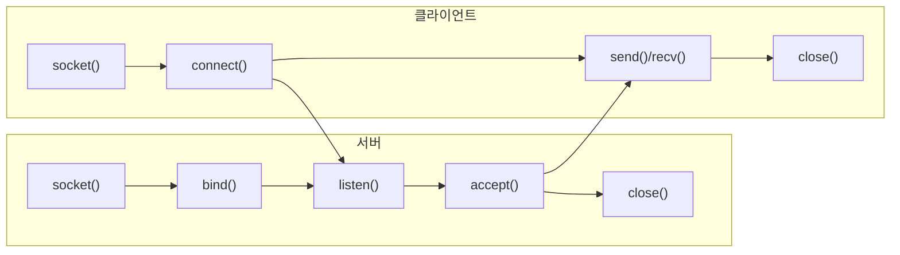
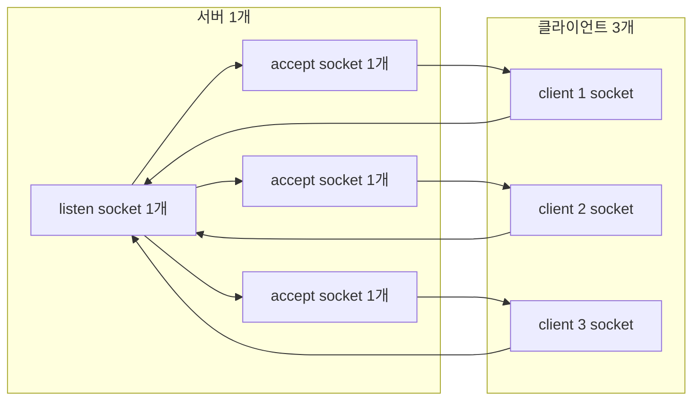
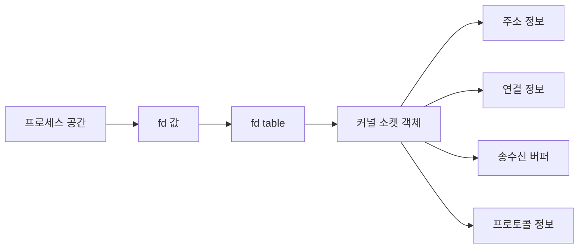
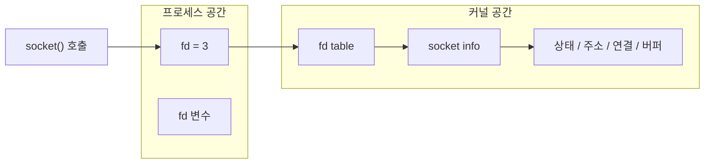
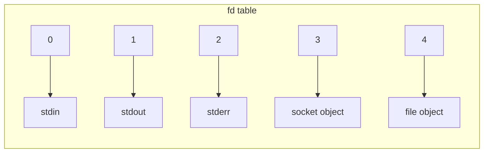
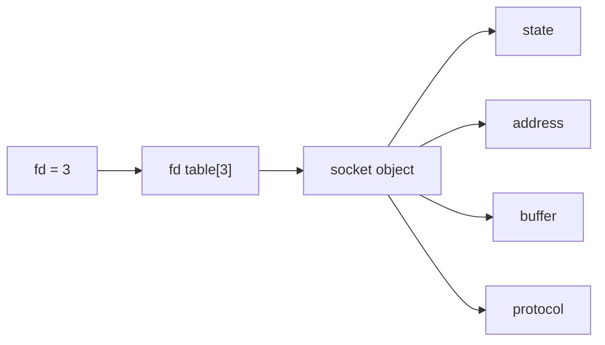

# 소켓 정리

## 목차

//나중에 완성 후 그에 맞춰서 목차 구성 예정

## 0. 소켓이 뭐고 왜 필요한가

- 소켓은 네트워크 통신을 위한 OS의 통신 인터페이스다.
- 연결 상태, 포트 기반 식별, 송수신 같은 통신 과정을 OS가 관리하게 해준다.
- 물리 입구가 아니라, 프로그램이 네트워크와 연결되는 창구다.

## 1. 서버와 클라이언트 흐름



## 1.1 클라이언트 함수

- `socket()`: 통신용 소켓 객체를 만든다.
- `connect()`: 서버 주소로 연결을 시도한다.
- `send()`: 연결된 서버로 데이터를 보낸다.
- `recv()`: 서버가 보낸 데이터를 받는다.
- `close()`: 소켓과 연결된 자원을 정리한다.

## 1.2 서버 함수

- `socket()`: 통신용 소켓 객체를 만든다.
- `bind()`: 소켓에 로컬 IP와 포트를 붙인다.
- `listen()`: 연결 요청을 받는 대기 상태로 바꾼다.
- `accept()`: 대기 중인 연결 하나를 꺼내 실제 통신용 소켓을 만든다.
- `close()`: 소켓과 연결된 자원을 정리한다.

### `listen` 소켓과 `accept` 소켓 차이

- `listen` 소켓은 연결 요청을 받는 대기용이다.
- `accept` 소켓은 특정 클라이언트 1명과 실제 통신하는 용도다.
- TCP는 클라이언트마다 연결 상태가 따로 필요해서 둘을 분리한다.

## 1.3 클라이언트가 여러 개일 때



- 서버는 `listen` 소켓 1개를 유지한다.
- 클라이언트가 3개면 `accept` 소켓도 3개가 생긴다.
- 서버 입장에서는 `listen` 소켓 1개 + `accept` 소켓 3개 = 총 4개다.
- 전체 시스템 기준으로는 클라이언트 소켓 3개까지 더해진다.

## 2.1 소켓 자원은 어떻게 보이는가



- 프로세스는 `fd`라는 정수값을 가진다.
- `fd`는 커널의 `fd table`을 통해 소켓 객체를 찾아간다.
- 커널의 소켓 객체 안에는 주소 정보, 연결 정보, 송수신 버퍼, 프로토콜 정보가 들어 있다.
- 그래서 소켓은 단순한 번호가 아니라, 커널이 관리하는 통신 자원이라고 보면 된다.
- 학습용으로는 `fd`를 인덱스, `fd table`을 배열처럼 봐도 된다.
- 다만 실제 구현을 정확히 따지면 단순한 C 배열이라고 단정하기보다, 인덱스로 바로 접근하는 테이블에 가깝다고 보는 게 안전하다.

## 3.1 `socket()` 실행 시 메모리 변화



- `socket()`을 호출하면 프로세스에는 `fd`라는 정수값이 생긴다.
- 커널에는 소켓을 관리하기 위한 내부 정보가 생긴다.
- `fd`는 소켓 자체가 아니라, 커널의 `fd table`을 통해 소켓 정보를 찾는 번호다.
- 실제 소켓 자원은 커널 메모리에 있다.
- `heap`은 `socket()`이 직접 만드는 공간이 아니라, 따로 `malloc()`을 쓸 때 사용하는 공간이다.

## 3.2 `fd table` 모양과 자료구조



- `fd table`은 프로세스마다 있는 인덱스 기반 테이블이다.
- `fd` 번호를 인덱스로 써서 바로 해당 엔트리를 찾는다.
- 예를 들어 `fd = 3`이면 `fd table[3]`을 보고 그 자원이 소켓인지 파일인지 찾는다.
- 그래서 학습용으로는 배열처럼 봐도 된다.
- 다만 실제 구현을 아주 엄밀하게 따지면 단순한 C 배열이라고 단정하지 말고, 인덱스로 바로 접근하는 테이블이라고 이해하는 게 안전하다.



- 소켓 객체는 상태, 주소, 연결 정보, 버퍼, 프로토콜 같은 내용을 들고 있다.
- 이 내용은 우리가 직접 쓰는 C 구조체라고 단정하기보다, 커널이 관리하는 내부 자료구조라고 보는 게 안전하다.

## `addrinfo` 구조체

`struct addrinfo`는 소켓을 만들기 전에 어떤 주소, 포트, 프로토콜로 통신할지 정하는 정보 묶음이다.

```c
struct addrinfo
{
  int ai_flags;
  int ai_family;
  int ai_socktype;
  int ai_protocol;
  socklen_t ai_addrlen;
  struct sockaddr *ai_addr;
  char *ai_canonname;
  struct addrinfo *ai_next;
};
```

### 필드 의미

- `ai_flags`: `getaddrinfo()` 동작 옵션
- `ai_family`: IPv4 또는 IPv6 같은 주소 패밀리
- `ai_socktype`: `SOCK_STREAM`, `SOCK_DGRAM` 같은 소켓 타입
- `ai_protocol`: TCP, UDP 같은 실제 프로토콜
- `ai_addrlen`: `ai_addr`가 가리키는 주소 구조체의 크기
- `ai_addr`: 실제 주소 정보
- `ai_canonname`: 정식 호스트명
- `ai_next`: 다음 후보 주소

## `sockaddr`와 실제 주소 구조체

- `sockaddr`는 여러 주소 구조체를 받기 위한 공통 타입이다.
- `sockaddr_in`과 `sockaddr_in6`에 실제 주소 정보가 들어간다.
- 형변환은 내용을 바꾸는 것이 아니라, 함수가 받을 수 있는 모양으로 포인터 타입만 맞추는 것이다.
