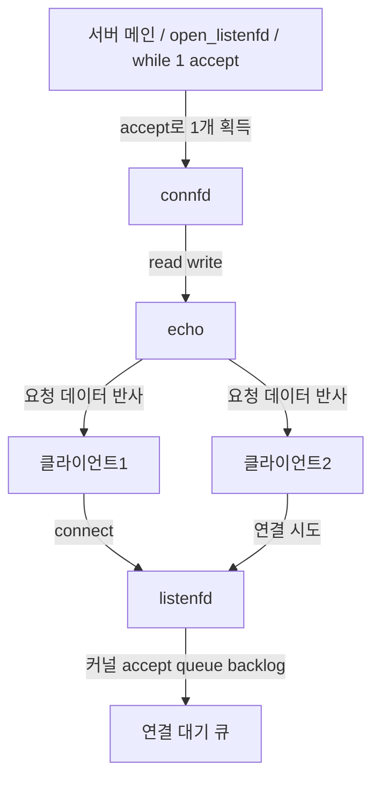
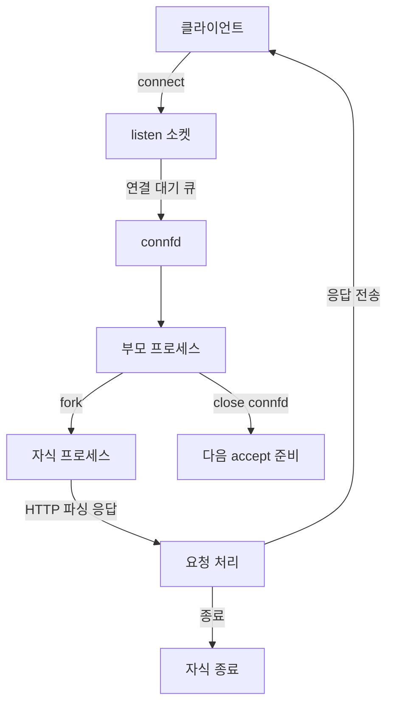
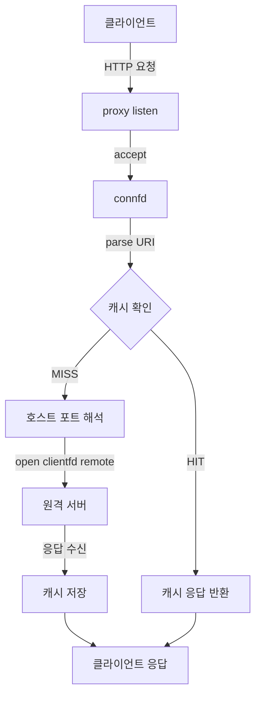

# 주차 과제 큰그림: Echo → Tiny → Proxy, 그리고 주간 커리큘럼 적합성 검증

이번 문서는 이번 주차 과제 방향(에코/타이니/프록시)과 네가 던진 질문(대기큐, 동시성, fork/thread pool, 캐시)을 과제 목표와 맞춰 정리한 체크 문서입니다.

## 1) 과제 정합성 판단 (스터디 플랜 기준)

- 기준 문서
  - `docs/StudyPlan/04_학습_플랜_2026-04-18_2026-04-21.md`
  - `docs/StudyPlan/03_학습_항목_리스트.md`

- 정합성 결론: **과제 목적은 커리큘럼 목적과 일치**합니다.
  - 네트워크 개념 → 소켓 인터페이스 → echo/tiny/proxy 구현의 학습 순서가 그대로 맞습니다.
  - 순차 처리, 동시 병렬 처리, 캐시까지 단계적으로 확장되어 있습니다.

## 2) 과제별 큰 그림 정리

### 2-1) Echo 서버

- 목표: 클라-서버 연결의 최소 구조와 순차 처리 이해
- 핵심 포인트: 연결 수락은 순차, 하나의 `connfd`를 처리하고 종료하는 흐름
- 대기큐(backlog)는 에코 서버 쪽으로 따로 옮겨서 [`echo.md`](/D:/03Dev/05Jungle/SW-AI-W06-08/webproxy_lab_docker/docs/Study/echo.md) 1.6에 정리했다.

#### 에코 서버의 대기큐를 코드 기준으로 보면

- `listenfd = Open_listenfd(argv[1]);`
  - 이 한 줄 안에서 `socket()`, `bind()`, `listen()`이 순서대로 실행된다.
  - 여기서 `listen()`이 커널에게 "이 포트로 들어오는 연결을 받아서 대기시켜라"라고 요청하는 부분이다.
- `listen()`의 `backlog`
  - 커널이 `accept()` 전에 임시로 쌓아둘 수 있는 연결 요청 개수의 힌트다.
  - 즉, 우리가 직접 만드는 큐가 아니라 커널이 관리하는 연결 대기 공간이다.
- `while (1) { connfd = Accept(listenfd, ...); ... }`
  - 서버는 계속 `accept()`를 호출하면서 대기큐에서 하나씩 꺼낸다.
  - 그래서 `accept()` 호출 전에는 아직 `connfd`가 존재하지 않고, `accept()` 이후에야 클라이언트와 실제로 통신할 수 있다.
- `echo(connfd);`
  - 대기큐에서 꺼낸 연결 하나를 처리하는 구간이다.
  - 이 루프가 끝나고 `Close(connfd);`가 실행되면 그 연결은 종료된다.

```mermaid
flowchart TD
    C1["클라이언트 1"] -->|connect| L["listenfd"]
    C2["클라이언트 2"] -->|connect| L
    C3["클라이언트 3"] -->|connect| L
    L -->|listen backlog| Q["커널 연결 대기 큐"]
    Q -->|Accept| Conn["connfd"]
    Conn -->|echo(connfd)| E["데이터 처리"]
    E -->|Close(connfd)| End["연결 종료"]
```



#### 코드 매핑
- `open_listenfd()` = `socket()`, `bind()`, `listen()`
- `listenfd`의 두 번째 인자 `backlog`가 대기큐 기본 크기 조절
- `accept()`는 커널 큐에서 하나씩 꺼내 `connfd` 생성/반환
- 순차 처리면 `accept -> echo -> close`가 직렬로 반복

### 2-2) Tiny 서버

- 목표: HTTP 요청 파싱/라우팅/응답까지 학습
- 핵심: 부모는 듣고, 자식은 실제 요청 처리



### 2-3) Proxy 서버

- 목표: 요청 전달 + 캐시로 성능 개선



## 3) fork 방식 vs thread pool 방식

### 4-1) 결론
- 네 추측처럼 프로세스 생성 비용이 큽니다.
- 그래서 고빈도 동시 요청에서는 thread pool가 유리한 경우가 많습니다.
- 다만 thread pool는 동시성 제어(락/경합)가 추가로 필요합니다.

### 4-2) 비교표

| 항목 | fork(프로세스) | thread pool(스레드) |
|---|---|---|
| 생성 비용 | 높음(프로세스 생성) | 낮음(초기 1회 생성) |
| 메모리 | 프로세스별 주소공간 독립 | 주소공간 공유(메모리 효율) |
| 격리성 | 높음(격리 강함) | 낮음(공유 자원 영향) |
| 동기화 필요 | 상대적으로 적음 | 높음(공유 상태 관리 필수) |
| 공유 자원 처리 | IPC 필요 | 직접 공유 구조 사용 가능 |
| 실패 영향 | 프로세스 단위 격리 | 하나의 버그가 전체에 영향 가능 |
| 적합 상황 | 강한 격리 필요 | 고빈도 동시 요청 처리 |

### 4-3) 스레드풀에서 동시성 이슈
- 공유 캐시, 로그 큐, 통계 카운터, DB 연결 풀에서 race condition 발생 가능
- 해결: 뮤텍스/조건변수/읽기쓰기락/작업 큐 분리/불변 객체 사용

## 4) 수요 코딩회의(SQL 병렬 처리)와 연결

- tiny/proxy의 fork 병렬화는 네트워크 동시성 입문
- 수요 코딩회의 과제(thread pool + SQL)는 같은 원리의 확장판
  - 요청 큐 + 고정 워커 + 동시 처리
  - 비용: 동기화 설계
  - 혜택: 처리량 증가, 지연 감소

## 5) 과제 진행 점검 체크리스트

- [ ] TCP 소켓 흐름(`socket, bind, listen, accept, read/write, close`) 설명 가능
- [ ] backlog 대기큐의 의미와 한계 설명 가능
- [ ] echo의 순차 처리와 tiny의 병렬 처리 차이 설명 가능
- [ ] proxy의 캐시 hit/miss 경로 설명 가능
- [ ] fork와 thread pool 장단점 비교 가능
- [ ] 공용 자원 race condition 시나리오 2개 이상 설명 가능
- [ ] 구현/테스트 결과를 정상/실패 케이스로 증빙
