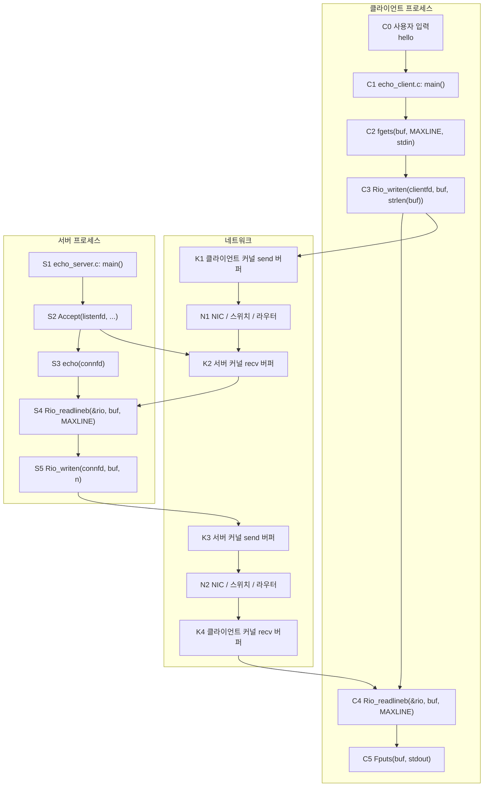
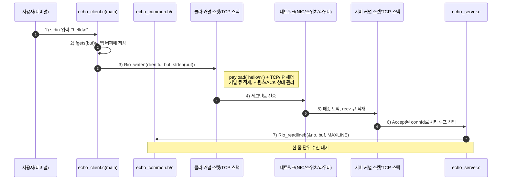
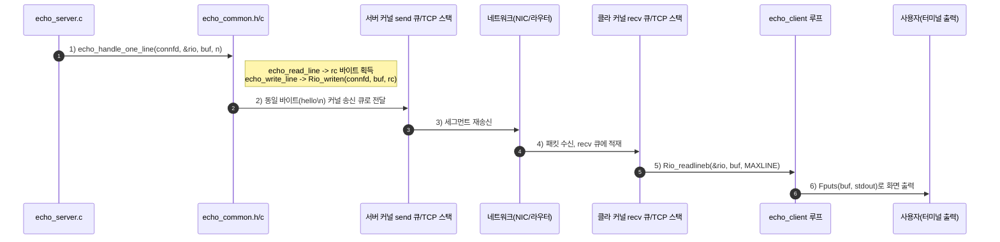
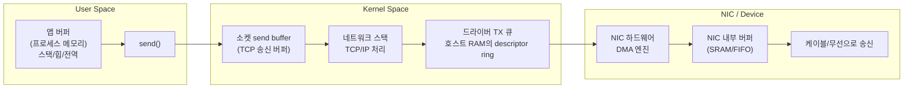
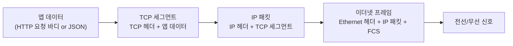

# 네트워크에서 데이터가 움직이는 경로
부제: 클라이언트-서버 송수신의 실제 저장 위치와 변화

## 1) 에코 서버: `hello`가 클라이언트에서 서버로 갔다가 다시 돌아오는 경로

현재 프로젝트의 에코 예제는 `echo_client.c`와 `echo_server.c`가 각각 `csapp.c`의 `Rio_*` 래퍼를 사용해서 동작한다.



식별자 설명

- `C0`: 사용자가 터미널에 입력한 문자열
- `C1`: 클라이언트의 시작점
- `C2`: `fgets()`가 입력을 읽어 `buf`를 채우는 단계
- `C3`: `buf` 내용을 서버로 보내는 단계
- `C4`: 서버 응답을 다시 읽는 단계
- `C5`: 화면에 출력하는 단계
- `K1`: 클라이언트 커널의 송신 버퍼
- `N1`: 네트워크 구간
- `K2`: 서버 커널의 수신 버퍼
- `S1`: 서버 프로그램의 시작점
- `S2`: 연결을 새로 받는 `accept()` 단계
- `S3`: 연결 하나를 처리하는 `echo()` 단계
- `S4`: 서버가 한 줄을 읽는 단계
- `S5`: 서버가 같은 내용을 다시 보내는 단계
- `K3`: 서버 커널의 송신 버퍼
- `N2`: 응답이 지나가는 네트워크 구간
- `K4`: 클라이언트 커널의 수신 버퍼

### 1-1) 클라이언트 → 서버 (`hello` 송신 + 서버 수신/에코 전처리)



### 1-2) 서버 → 클라이언트 (에코 응답 + 반환 수신)



### 같은 데이터가 유지되는 이유
- 에코 서버는 바이트를 가공하지 않고 `echo_handle_one_line`에서 즉시 재전송한다.
- 따라서 응답은 `hello\n` 내용 그대로라 화면에서도 동일하게 보인다.
- 변하는 것은 네트워크 계층 헤더와 소켓 상태 정보(시퀀스/ACK/TTL 등)다.

---

## 실습 예시(고정)
- 이 포스트는 아래 예시를 기준으로 공부한다.
  - **클라이언트:** `127.0.0.1`에서 실행되는 프로그램(예: Python 소켓 클라이언트)
  - **서버:** `127.0.0.1:8080`에서 실행되는 프로그램(예: Python 소켓 서버)
  - **클라 송신 데이터:** `{\"id\":\"req-1\",\"type\":\"ping\",\"payload\":\"hello\",\"len\":5}`
  - **서버 응답 데이터:** `{\"id\":\"req-1\",\"status\":\"ok\",\"reply\":\"hello\",\"at\":\"2026-04-18T...+09:00\"}`
- 핵심 목표:
  - 클라 앱 버퍼에서 서버 앱 버퍼까지 데이터가 어떤 경로·버퍼를 통해 이동하는지 추적
  - 응답이 역순 경로로 돌아올 때 캡슐화/역캡슐화 흐름 이해

이 문서는 "클라이언트와 서버 사이를 오가는 데이터가 어디에 저장되고, 어떤 저장장치/버퍼를 거치며, 소켓·패킷은 어떻게 변형되는지"를 한 번에 이해하도록 정리한 학습 노트이다.


## 한 줄 요약

- **클라/서버 양 끝에서의 시작과 끝은 보통 RAM(애플리케이션 버퍼)**.
- 중간 전송 동안은 **커널 버퍼(스택 버퍼), 네트워크 인터페이스(NIC) 버퍼, 스위치/라우터의 큐**를 지나며 **영구 저장소(디스크)로는 거의 안 간다**.
- 데이터는 라우팅을 거치며 형식이 바뀌지 않고 **캡슐화가 추가**된다.
  - 앱 데이터 → TCP 세그먼트 → IP 패킷 → 이더넷 프레임.
- 서버 수신 시에는 반대 순서로 **캡슐화가 제거**된다.

## 1) 송신: 클라이언트에서 처음 시작되는 곳부터



### 1-1. 애플리케이션 메모리(유저 공간)

브라우저/클라이언트 앱이 HTTP 요청 바이트를 만든다.  
이 데이터는 우선 **유저 공간의 메모리 버퍼**에 존재한다.

- 예: Python `send()`, JavaScript `fetch`, 브라우저 HTTP 라이브러리 내부 버퍼
- 여기서부터 **커널 공간**으로 전달하려고 `send` 계열 함수 호출
- 영구 저장은 아님. **RAM 임시 보관**이다.

### 1-2. 소켓 송신 큐 (커널 버퍼)

`send` 호출 시 데이터는 커널의 `TCP send buffer`(송신 큐)로 이동한다.

- 커널의 역할:
  - 패킷 생성(Segmentation)
  - 순번/재전송/타이밍 제어(TCP)
  - 흐름제어, 윈도우 관리
- 이 단계는 **OS 메모리 영역**의 버퍼.

> 여기서 데이터는 앱 메모리에서 커널 메모리로 “메모리 소유권이 바뀌어” 관리된다.  
> 실무에서 "copy"가 몇 번 일어나는지에 따라 성능이 달라지고, 그래서 `sendfile`/zero-copy 같은 기법이 중요해진다.

### 1-3. 네트워크 드라이버 & NIC 링 버퍼

커널은 NIC(네트워크 카드)로 전송할 패킷을 **TX descriptor / 큐**에 넣는다.

실제로는:
- NIC 드라이버가 DMA 영역/매핑된 메모리를 사용해 데이터를 전달
- NIC 내부의 **TX 버퍼/FIFO/링 버퍼**로 전송 준비

즉, 아직도 **RAM + NIC 내부 메모리(하드웨어 버퍼)** 를 왔다 갔다 하며, 디스크는 관여하지 않는다.

### 1-4. 물리적 전송 전의 마지막 모양: 패킷 변형(캡슐화)



링크 송신 직전 또는 NIC에서:
- 앱 데이터(payload)에 TCP 헤더 추가
- IP 헤더 추가
- Ethernet 헤더(및 FCS 등) 추가

이 시점에서 네트워크를 떠나는 단위는 **프레임/패킷**이며, 이는 전선/무선 신호로 인코딩된다.

- MAC 주소(이더넷), IP 주소, TCP 포트(출발/도착지) 정보가 추가
- 경로가 아니라 **캡슐화**된 데이터 구조가 바뀌는 과정

## 2) 네트워크 구간: 스위치/라우터가 하는 일

네트워크 구간은 “공중 비행”이 아니다. 중간 장치들마다 버퍼와 처리기가 있다.

### 2-1. 스위치(2계층) 경유

- 목적지 MAC으로 프레임 포워딩
- 스위치 내부 큐에 짧게 대기 가능(버퍼)
- 필요 시 큐잉 지연 가능 (버퍼가 꽉 차면 드롭)

### 2-2. 라우터(3계층) 경유

- IP 헤더를 읽고 목적지 라우팅 테이블 기반으로 다음 홉 결정
- 패킷이 변경되는 항목:
  - TTL 감소
  - 체크섬/헤더 일부 재작성(경로 바뀜/네트워크 경계에서)
  - 필요한 경우 NAT(주소/포트) 변환
- 라우터 내부에서도 버퍼/큐에서 대기

### 2-3. 중간 구간에서의 저장 위치 요약

- 대부분 **램 기반 버퍼(장비 메모리), 큐, ASIC/버퍼 메모리**
- 디스크 접근은 통상 없음(지연 큰 작업은 장애 시 로그/캡처용 분석에 한정)

## 3) 수신: 서버 도착 후 복원

### 3-1. 서버 NIC RX 큐

서버 NIC가 프레임을 받아 **RX 큐**에 저장.

- PHY/링크 계층에서 신호 복호화
- CRC/FCS 검증
- 커널이 DMA로 패킷 데이터를 가져옴

### 3-2. 커널 수신 큐

서버 커널의 `TCP receive buffer`에 적재.

- IP/TCP 헤더 검증
- 세션 매핑(소켓 식별)
- 순서 정렬, ACK 처리, 재전송 조정

### 3-3. 사용자 공간 수신 버퍼

`recv` 호출 시 커널에서 애플리케이션 버퍼로 복사(또는 zero-copy 경로면 최소 복사).

- 최종적으로 웹서버가 `HTTP request` 문자열/바이트열로 해석
- 라우팅/인증/비즈니스 로직 처리

## 4) 서버 응답도 같은 경로를 되돌아감 (역방향)

서버가 응답을 쓰면 정확히 반대 순서로 동일 구조를 거친다.

응답 시작: 서버 앱 버퍼 → 커널 송신 큐 → NIC TX 큐 → 네트워크 장치들 → 서버측이 아닌 클라이언트 NIC/커널/앱 버퍼.

## 5) 같은 데이터가 어떻게 “변화”하는가?

같은 바이트열이 형태를 바꿔가며 이동한다.

- **응답 바디(사용자 데이터)**: 마지막까지 논리적으로 동일
- **헤더 부분**: 매 계층에서 추가/검사/재작성
  - 앱 계층: URL, 헤더, 바디
  - TCP 계층: 시퀀스, ACK, 포트
  - IP 계층: 출발/목적지 IP, TTL
  - 이더넷 계층: MAC

핵심은 **내용은 유지하고 메타데이터가 감싸거나 갱신**된다는 점이다.

## 6) 많이 헷갈리는 포인트 (정리)

### Q1. 이 데이터가 언제 디스크에 저장되나?
보통의 실시간 송수신은 주로 RAM/하드웨어 큐에만 존재한다.  
디스크는 네트워크 로그, 패킷 캡처 파일, 스왑, 메시지큐/데이터베이스에 넣을 때만 보조적으로 관여한다.

### Q2. 소켓은 저장소인가?
소켓 자체는 “인터페이스”다.  
실제 데이터는 소켓과 연동된 **커널 버퍼**(send/recv 큐)에 존재한다.

### Q3. 패킷이 유실되면?
손실은 대개 중간 장치 큐 부족/링크 오류/혼잡/재전송 타임아웃에서 발생한다.  
TCP는 시퀀스/ACK 기반으로 재전송한다.

## 7) 체크리스트(시험/면접용으로 암기)

1. 클라이언트 앱 버퍼 → 커널 송신 큐(TCP)
2. NIC TX 큐/버퍼
3. 링크에서 프레임 송신 + 스위치/라우터 큐
4. 라우터/방화벽/NAT 등에서 수정/포워딩
5. 서버 NIC RX 큐 → 커널 수신 큐
6. 앱 recv 버퍼로 복사
7. 서버 처리 후 응답이 역순으로 동일 경로 반복

## 8) 간단한 그림(개념)

```
[클라 앱 메모리]
   -> [클라 커널 send buffer]
     -> [클라 NIC TX 큐/버퍼]
       -> (TCP 헤더 추가) -> (IP 헤더 추가) -> (Ethernet 헤더 추가)
         -> 네트워크(스위치/라우터 큐, TTL/NAT/포워딩)
           -> [서버 NIC RX 큐] -> [서버 커널 recv buffer] -> [서버 앱 메모리]
             -> 서버 처리 -> 응답은 반대 경로
```

## 7) 다음에 공부하면 좋은 주제

- TCP의 3-way handshake와 종료 과정(상태 기계)
- 슬라이딩 윈도우/혼잡 제어
- NAT 동작 시 헤더 수정 포인트
- NIC 오프로드/TSO/LRO/zero-copy 성능 기법
- packet capture(`tcpdump`, Wireshark)로 실제 패킷 캡슐화 확인

---

1
